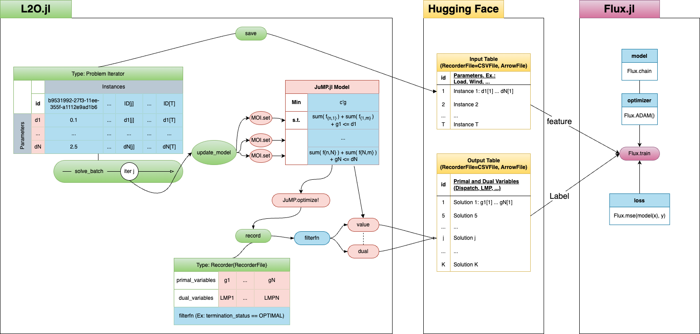

<div style="overflow: auto;">
    <h1 style="float: left;">LearningToOptimize.jl</h1>
    <div style="float: right; margin-left: 20px;">
      
    </div>
</div>

Learning to optimize (LearningToOptimize) package that provides basic functionalities to help fit proxy models for optimization.

[](https://andrewrosemberg.github.io/LearningToOptimize.jl/stable/)
[](https://andrewrosemberg.github.io/LearningToOptimize.jl/dev/)
[](https://github.com/andrewrosemberg/LearningToOptimize.jl/actions/workflows/CI.yml?query=branch%3Amain)
[](https://codecov.io/gh/andrewrosemberg/LearningToOptimize.jl)

# Flowchart Summary



## Generate Dataset
This package provides a basic way of generating a dataset of the solutions of an optimization problem by varying the values of the parameters in the problem and recording it.

### The Problem Iterator

The user needs to first define a problem iterator:

```julia
# The problem to iterate over
model = Model(() -> POI.Optimizer(HiGHS.Optimizer()))
@variable(model, x)
p = @variable(model, p in MOI.Parameter(1.0)) # The parameter (defined using POI)
@constraint(model, cons, x + p >= 3)
@objective(model, Min, 2x)

# The parameter values
parameter_values = Dict(p => collect(1.0:10.0))

# The iterator
problem_iterator = ProblemIterator(parameter_values)
```

The parameter values of the problem iterator can be saved by simply:

```julia
save(problem_iterator, "input_file", CSVFile)
```

Which creates the following CSV:

| id |  p  |
|----|-----|
|  1 | 1.0 |
|  2 | 2.0 |
|  3 | 3.0 |
|  4 | 4.0 |
|  5 | 5.0 |
|  6 | 6.0 |
|  7 | 7.0 |
|  8 | 8.0 |
|  9 | 9.0 |
| 10 | 10.0|

ps.: For illustration purpose, I have represented the id's here as integers, but in reality they are generated as UUIDs. 

### The Recorder

Then chose what values to record:

```julia
# CSV recorder to save the optimal primal and dual decision values
recorder = Recorder{CSVFile}("output_file.csv", primal_variables=[x], dual_variables=[cons])

# Finally solve all problems described by the iterator
solve_batch(problem_iterator, recorder)
```

Which creates the following CSV:

| id |   x  | dual_cons |
|----|------|-----------|
|  1 |  2.0 |       2.0 |
|  2 |  1.0 |       2.0 |
|  3 | -0.0 |       2.0 |
|  4 | -1.0 |       2.0 |
|  5 | -2.0 |       2.0 |
|  6 | -3.0 |       2.0 |
|  7 | -4.0 |       2.0 |
|  8 | -5.0 |       2.0 |
|  9 | -6.0 |       2.0 |
| 10 | -7.0 |       2.0 |

ps.: Ditto id's.

Similarly, there is also the option to save the database in arrow files:

```julia
recorder = Recorder{ArrowFile}("output_file.arrow", primal_variables=[x], dual_variables=[cons])
```

## Learning proxies

In order to train models to be able to forecast optimization solutions from parameter values, one option is to use the package Flux.jl:

```julia
# read input and output data
input_data = CSV.read("input_file.csv", DataFrame)
output_data = CSV.read("output_file.csv", DataFrame)

# Separate input and output variables
output_variables = output_data[!, Not(:id)]
input_features = innerjoin(input_data, output_data[!, [:id]], on = :id)[!, Not(:id)] # just use success solves

# Define model
model = Chain(
    Dense(size(input_features, 2), 64, relu),
    Dense(64, 32, relu),
    Dense(32, size(output_variables, 2))
)

# Define loss function
loss(x, y) = Flux.mse(model(x), y)

# Convert the data to matrices
input_features = Matrix(input_features)'
output_variables = Matrix(output_variables)'

# Define the optimizer
optimizer = Flux.ADAM()

# Train the model
Flux.train!(loss, Flux.params(model), [(input_features, output_variables)], optimizer)

# Make predictions
predictions = model(input_features)
```

## Coming Soon

Future features:
 - ML objectives that penalize infeasible predictions;
 - Warm-start from predicted solutions.
